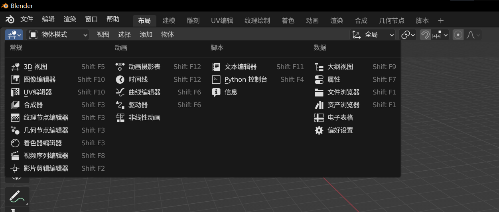
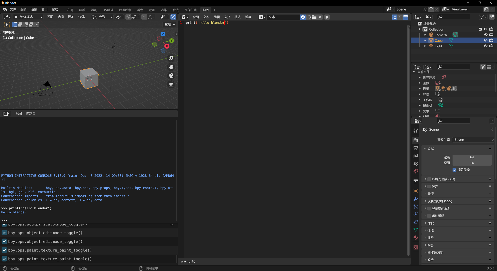
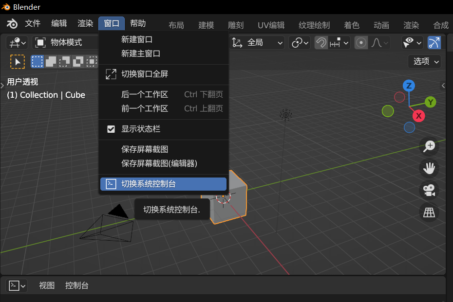
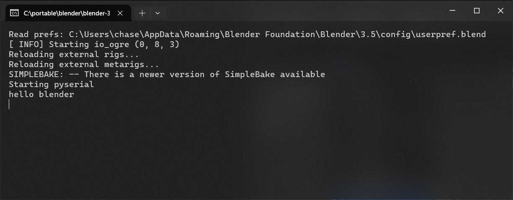
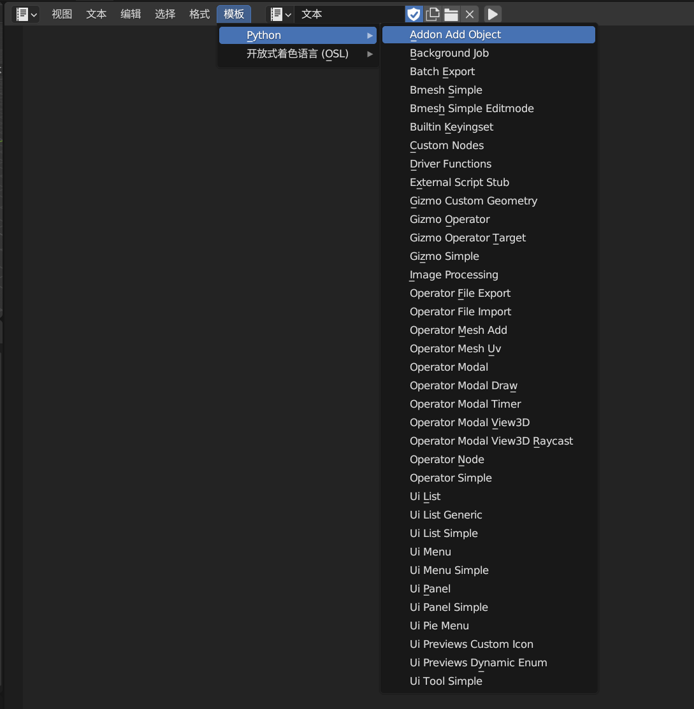

Blender 作为一个十分强大的开源软件，插件系统的存在更是让其可以拓展无限的功能。

计划使用Blender软件作为项目中的数字孪生体部分，为了实现与项目中其他部分的通信，用于传输各项数据，决定学习并开发一款插件实现该功能。

首先，在Blender里面可以很方便的执行python脚本。

每个编辑器左上角可以切换编辑器类型，文本编辑器可以用于编辑python脚本并运行，Python控制台中可以直接执行Python。

也可以切换到默认的脚本工作区，默认的工作区位于顶部菜单栏右侧，也可以自定义工作区。切换到脚本工作区后，默认显示下面的编辑器。

控制台中直接执行代码，直接得到结果，文本编辑器中新建脚本，执行，在系统终端中得到结果。如果没有看到结果，点击菜单栏的窗口，切换系统控制台。

在文本编辑器中点击模板，可以看到很多示例，可以点击其中的一些体验插件的魅力。

官方API参考网址：[Blender 4.0 Python API Documentation — Blender Python API](https://docs.blender.org/api/current/)
