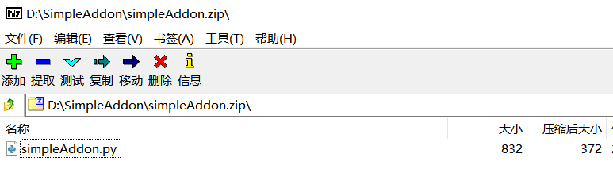
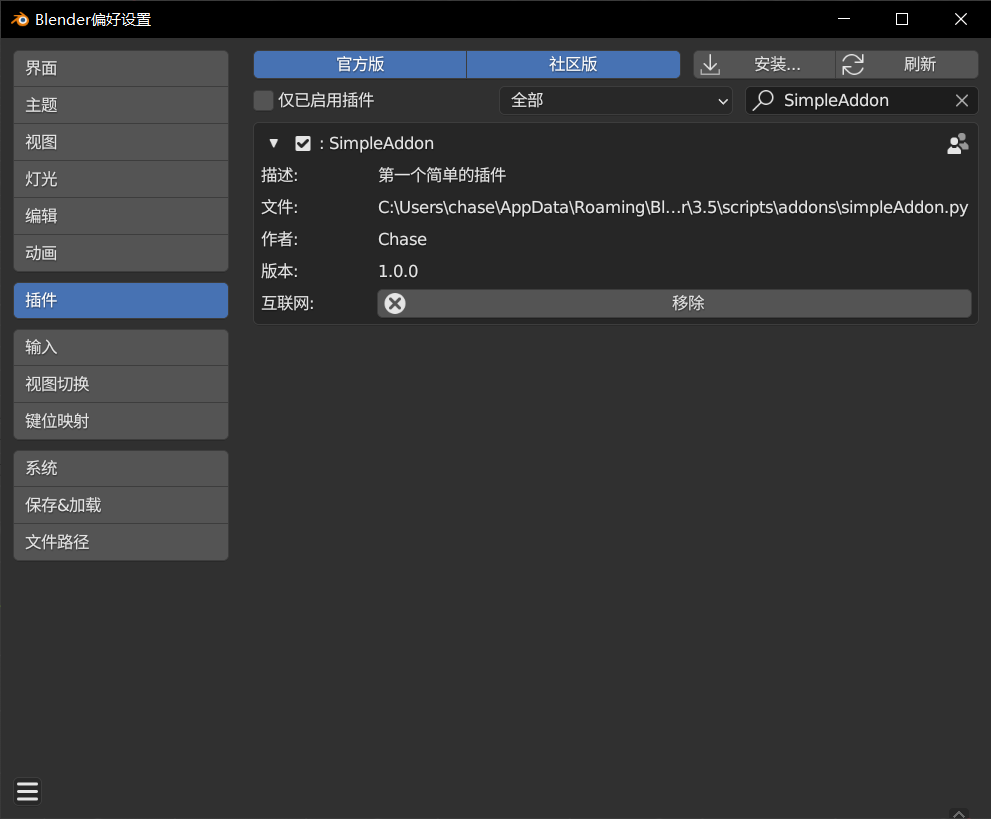
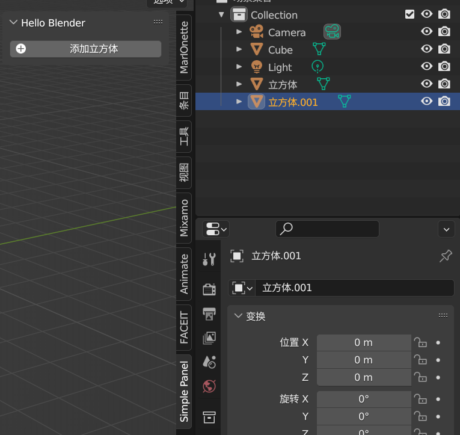

插件开发好之后，可以打包以后分享给别人使用，这里介绍打包的过程。

# 步骤

## 添加bl_info

`bl_info`是Blender插件中一个重要的元数据字典，它包含了关于插件的基本信息。在Blender插件开发中，你需要在插件代码中定义这个字典，以便告诉Blender有关你的插件的一些重要信息。

只有添加了bl_info才能在插件设置面板看到并设置参数，开关插件等操作。

```python
bl_info = {
	"name": "SimpleAddon",
	"author": "Chase",
	"version": (1, 0, 0),
	"blender": (3, 5, 0),
	"location": "",
	"description": "第一个简单的插件",
	"warning": "",  
	"wiki_url": "",  
	"category": ""
}
```

字段说明：

- `"name"`：插件名称。
- `"author"`：插件作者。
- `"version"`：插件版本号，使用元组表示。
- `"blender"`：插件所支持的Blender版本，同样使用元组表示。
- `"location"`：插件在Blender中的位置或菜单项。
- `"description"`：对插件的简要描述。
- `"warning"`：警告信息，如果有的话。
- `"wiki_url"`：插件的文档或wiki页面链接。
- `"category"`：插件所属的分类，例如"Object"、"Mesh"等。

## 压缩文件

手动压缩为zip文件，方便传输（PS：python文件也可以直接安装）。

这里注意压缩文件最外层是否带有目录，如果有目录，则需要有`__`init`__`.py文件，否则插件不会显示在插件面板中。这里为了简单方便，直接不带目录。



## 安装插件

插件安装跟别的插件一样安装就可以了，主要有两种方式。安装后别忘记在插件设置面板中启用插件。



## 插件使用

安装后需要在插件设置面板中启用插件，然后就可以在N面板中看到插件了。点击按钮可以添加立方体，结果与之前的一致。



至此，一个插件从开发，到打包，安装使用整个流程都完整了。